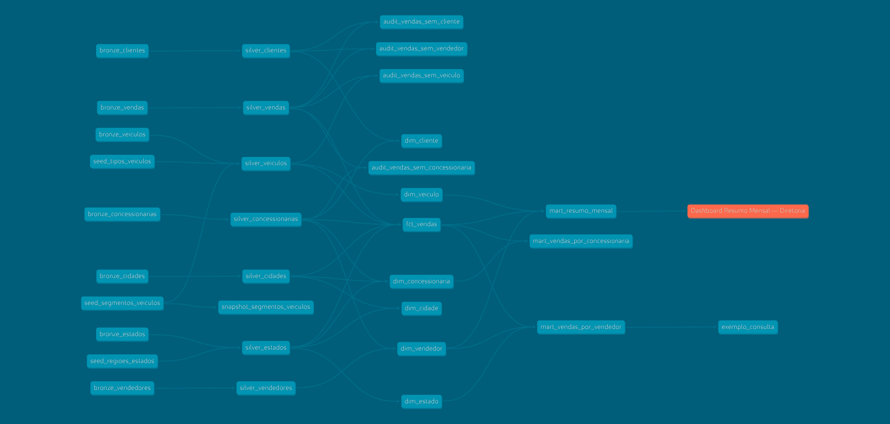

# Data Engineering — Pipeline de Dados Automotivos

Pipeline de Engenharia de Dados desenvolvido com **PostgreSQL, dbt e DuckDB**, utilizando uma arquitetura em camadas baseada no conceito de **Medallion Architecture**.

O projeto realiza a ingestão, transformação, padronização, validação e organização de dados relacionados a vendas de veículos, disponibilizando informações tratadas para análises e consumo analítico.

---

## Tecnologias

- **PostgreSQL** — banco de dados de origem
- **dbt** — transformação, modelagem e testes de dados
- **DuckDB** — banco analítico utilizado no ambiente local
- **SQL** — desenvolvimento das transformações
- **Git/GitHub** — versionamento e documentação do projeto

---

## Arquitetura

O projeto utiliza uma arquitetura em camadas baseada no conceito de **Medallion Architecture**, organizando os dados em três níveis de transformação:

### Bronze

Camada responsável pela ingestão e preparação inicial dos dados provenientes do PostgreSQL.

Principais atividades:

- Padronização inicial dos dados
- Normalização de textos
- Organização dos dados de origem
- Aplicação de transformações básicas

### Silver

Camada responsável pelo tratamento e preparação dos dados para consumo analítico.

Principais atividades:

- Limpeza e transformação dos dados
- Deduplicação
- Padronização de informações
- Aplicação de regras de negócio
- Processamento incremental

### Gold

Camada destinada aos dados preparados para análise e consumo.

A camada Gold está organizada em:

- **Dimensions** — dimensões utilizadas para contextualizar as vendas
- **Facts** — tabelas de fatos com informações transacionais
- **Audits** — consultas para validação da qualidade e integridade dos dados
- **Marts** — modelos preparados para análises e consumo de negócio

O fluxo geral do pipeline é:

**PostgreSQL → Bronze → Silver → Gold → Análises e Dashboards**

---

## Estrutura do Projeto

```text
data-engineering-concessionaria/
│
├── analyses/
│   └── exemplo_consulta.sql
│
├── macros/
│   ├── audit_columns.sql
│   ├── classify_discount.sql
│   ├── generate_schema_name.sql
│   ├── generate_surrogate_key.sql
│   ├── incremental_filter.sql
│   ├── normalize_text.sql
│   ├── percentage_change.sql
│   ├── safe_divide.sql
│   └── standardize_vehicle_type.sql
│
├── models/
│   ├── bronze/
│   ├── silver/
│   └── gold/
│       ├── audits/
│       ├── dimensions/
│       ├── facts/
│       └── marts/
│
├── seeds/
│   └── reference/
│       ├── seed_regioes_estados.csv
│       ├── seed_segmentos_veiculos.csv
│       └── seed_tipos_veiculos.csv
│
├── snapshots/
│   └── snapshot_segmentos_veiculos.sql
│
├── tests/
│   └── generic/
│
├── dbt_project.yml
├── packages.yml
├── package-lock.yml
├── requirements.txt
├── load_env.sh
└── .gitignore
```

---

## Pipeline de Dados

O pipeline realiza as seguintes etapas:

### 1. Ingestão

Dados provenientes do banco de dados **PostgreSQL** são utilizados como fonte para o processo de transformação.

### 2. Transformação

Os dados são tratados utilizando **dbt**, com aplicação de:

- Padronização;
- Normalização;
- Regras de negócio;
- Macros reutilizáveis;
- Filtros incrementais.

### 3. Modelagem

Os dados são organizados nas camadas:

**Bronze → Silver → Gold**

Na camada Gold são construídas:

- Dimensões;
- Tabela fato;
- Marts analíticos;
- Auditorias de qualidade.

### 4. Qualidade

São executados testes automatizados utilizando os recursos de testes do **dbt**, além de consultas SQL de auditoria.

### 5. Consumo

Os dados tratados são disponibilizados para consultas analíticas e construção de dashboards.

---

## Qualidade dos Dados

A qualidade dos dados é validada ao longo do pipeline utilizando os recursos de testes do **dbt** e consultas de auditoria.

### Testes automatizados

O projeto possui testes genéricos para validar diferentes aspectos dos dados, incluindo:

- **Valores positivos** — validação de valores que não devem ser negativos;
- **Intervalos de valores** — verificação de valores dentro de limites esperados;
- **Datas** — validação de datas para evitar valores anteriores ou muito distantes no futuro;
- **Campos obrigatórios** — identificação de registros que não atendem às regras de preenchimento.

Os testes são executados pelo dbt durante a construção e validação dos modelos.

### Auditorias

Além dos testes automatizados, a camada **Gold** possui consultas de auditoria para identificar possíveis problemas de integridade entre as vendas e suas entidades relacionadas:

- Vendas sem cliente;
- Vendas sem concessionária;
- Vendas sem veículo;
- Vendas sem vendedor.

Essa abordagem permite identificar inconsistências e aumentar a confiabilidade dos dados antes do consumo analítico.

---

## Modelagem Analítica

A camada **Gold** organiza os dados em um modelo dimensional, facilitando a análise das vendas e o consumo das informações por diferentes áreas do negócio.

### Tabela Fato

A principal tabela fato do projeto é:

- **`fct_vendas`** — concentra os registros de vendas e suas principais métricas e relacionamentos.

### Dimensões

As dimensões fornecem o contexto necessário para analisar as vendas:

- **`dim_cliente`** — informações dos clientes;
- **`dim_concessionaria`** — informações das concessionárias;
- **`dim_vendedor`** — informações dos vendedores;
- **`dim_veiculo`** — informações dos veículos;
- **`dim_cidade`** — informações geográficas das cidades;
- **`dim_estado`** — informações dos estados.

### Marts

A partir dos modelos da camada Gold, foram criados marts direcionados ao consumo analítico:

- **`mart_resumo_mensal`** — consolidação dos principais indicadores de vendas por período;
- **`mart_vendas_por_concessionaria`** — análise das vendas por concessionária;
- **`mart_vendas_por_vendedor`** — análise das vendas por vendedor.

Essa organização permite separar os dados transacionais das estruturas destinadas à análise, facilitando consultas, criação de indicadores e desenvolvimento de dashboards.

---

## Data Lineage

O lineage do dbt apresenta visualmente o fluxo dos dados ao longo do pipeline, desde as fontes e dados de referência até os modelos analíticos da camada Gold.

A visualização permite acompanhar as dependências entre os modelos e compreender como os dados são transformados ao longo do processo.



---

## Como Executar o Projeto

### 1. Clonar o repositório

```bash
git clone https://github.com/leticiamalafaia/data-engineering-concessionaria.git
cd data-engineering-concessionaria
```

### 2. Criar e ativar o ambiente virtual

```bash
python3 -m venv .venv
source .venv/bin/activate
```

### 3. Instalar as dependências

```bash
pip install -r requirements.txt
```

### 4. Configurar as variáveis de ambiente

Crie um arquivo `.env` com as credenciais necessárias para conexão com o PostgreSQL.

Exemplo:

```env
SOURCE_POSTGRES_HOST=localhost
SOURCE_POSTGRES_PORT=5432
SOURCE_POSTGRES_DATABASE=seu_database
SOURCE_POSTGRES_USER=seu_usuario
SOURCE_POSTGRES_PASSWORD=sua_senha
```

> O arquivo `.env` não deve ser versionado no GitHub.

### 5. Carregar as variáveis de ambiente

No Linux/macOS:

```bash
source load_env.sh
```

### 6. Verificar a configuração do dbt

```bash
dbt debug
```

### 7. Instalar dependências do projeto

```bash
dbt deps
```

### 8. Executar o pipeline

```bash
dbt build
```

O comando `dbt build` executa os modelos e testes do projeto, validando o pipeline durante a construção dos dados.

---

## Principais Comandos dbt

| Comando | Descrição |
|---|---|
| `dbt debug` | Verifica a configuração e conexão do projeto |
| `dbt deps` | Instala as dependências definidas no projeto |
| `dbt seed` | Carrega os arquivos CSV utilizados como dados de referência |
| `dbt run` | Executa os modelos do projeto |
| `dbt test` | Executa os testes de qualidade |
| `dbt build` | Executa modelos, seeds e testes |
| `dbt snapshot` | Executa os snapshots configurados |

---

## Objetivos do Projeto

Este projeto foi desenvolvido com o objetivo de aplicar conceitos de **Engenharia de Dados** em um pipeline completo, incluindo:

- Arquitetura de dados em camadas;
- ETL/ELT;
- Transformação de dados com dbt;
- Modelagem dimensional;
- Processamento incremental;
- Testes de qualidade;
- Auditoria de dados;
- Macros reutilizáveis;
- Versionamento com Git;
- Documentação técnica.

---

## Possíveis Evoluções

Algumas evoluções que podem ser incorporadas ao projeto:

- Orquestração do pipeline;
- Integração com serviços de cloud;
- Implementação de monitoramento e observabilidade;
- Criação de CI/CD para validação automática do projeto;
- Integração com ferramentas de visualização de dados;
- Evolução da arquitetura para ambientes de produção.

---

## Autora

**Anna Letícia Malafaia**

Projeto desenvolvido para estudo e prática de conceitos de **Engenharia de Dados, SQL, dbt e modelagem de dados**.

---

## Licença

Este projeto é destinado a fins educacionais e de portfólio.